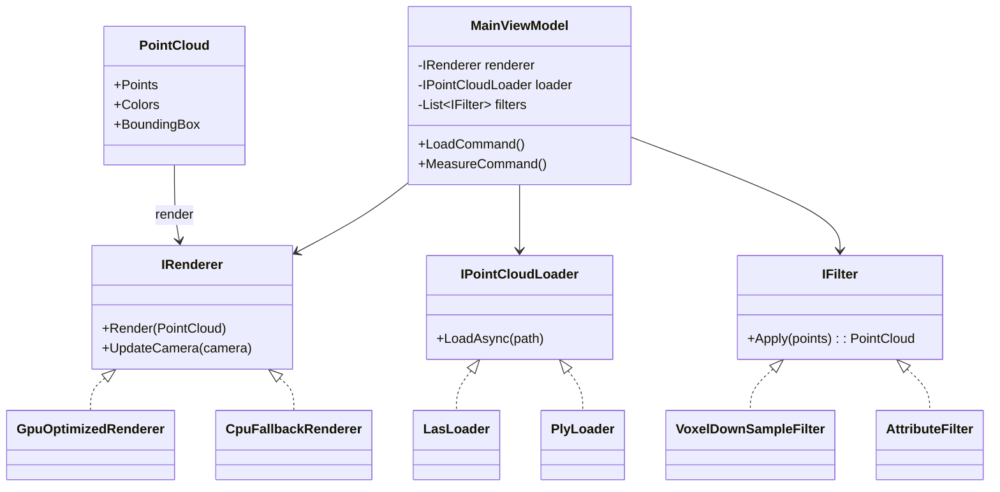

开发日志（2025.11.19 ~ 2025.12.20）
作者：沈文浩
# 第1章 概述
## 1.1 设计目的
- 背景：面向大规模三维点云（测绘/倾斜摄影/移动测量）进行加载、浏览、量测与过滤，支持 GPU/CPU 混合渲染，解决大坐标、性能、交互反馈等痛点。
- 目标：在 Windows 11 + .NET 8 + WPF/HelixToolkit.SharpDX 环境下，提供高效、易用、可扩展的点云可视化与基础分析工具。
- 面向对象三大特性体现：  
  - 封装：用接口与基类隐藏渲染/加载/过滤细节，对外暴露统一的加载、渲染、测量入口。  
  - 继承：GPU/CPU 渲染器、不同格式的点云读取器、各类过滤器均继承通用基类，复用公共逻辑。  
  - 多态：通过接口（IRenderer、IPointCloudLoader、IFilter）与虚方法，在运行时按资源/硬件选择不同实现（GPU/CPU、LAS/PLY、体素/强度过滤）。
- 地理信息/测绘价值：支持大坐标归一化避免黑屏，流式抽稀降低内存，交互量测（距离/面积）辅助质检与成果快速检查。

## 1.2 主要功能（至少6项）
1) LAS/PLY 点云文件加载，支持流式读取与进度提示。  
2) GPU 优化渲染与 CPU 备用渲染路径，自动选择合适的渲染器。  
3) 点云坐标归一化与包围盒居中，避免大坐标导致的黑屏/精度损失。  
4) 体素/随机抽稀过滤与属性过滤（强度/分类），可在加载或交互时应用。  
5) 交互量测：距离、面积（投影 + shoelace）、点拾取高亮。  
6) 视角与相机控制：轨迹球、缩放限制、俯仰约束，支持状态同步与重置。  
7) 基础项目存取：保存/恢复视角、过滤配置、抽稀参数，日志记录关键操作。  
8) UI 反馈：状态栏与通知条同步显示加载/渲染/测量状态。

总体概览
- 项目：PointCloudViz_Final（三维点云可视化基础版）
- 目标：支持大规模点云加载、GPU/CPU 渲染、交互测量、过滤与基本项目存取
## 1.3 算法思路
- 坐标归一化：以点云包围盒中心为平移原点，减去中心后送入渲染管线；需要时记录偏移用于导出/测量还原。  
- 流式 LAS 读取：边读边写缓存，超过设定上限即抽稀（优先随机保留/体素下采样）。  
- 体素下采样：哈希体素格子聚类，聚合坐标/颜色/强度（均值或首个），控制上限点数。  
- 面积测量：将拾取点拟合局部平面（Newell 法线），投影到 2D，使用 shoelace 计算面积并校验共面性。  
- 渲染：GPU 路径使用 HelixToolkit.SharpDX + DynamicBuffer 更新；CPU 路径使用 WPF 原生点集合作为兜底。  
- 过滤：强度/分类阈值过滤、视锥裁剪；接口化便于新增过滤器。

## 1.4 运行环境
- 硬件：CPU Intel(R) Core(TM) i7-14650HX @ 5.20 GHz；RAM 16 GB；建议独显支持 DirectX 11+。  
- 软件：Windows 11；.NET 8.0；开发工具 Visual Studio 2026；WPF + HelixToolkit.SharpDX。

# 第2章 总体设计
## 2.1 模块划分
- IO：LAS/PLY 读取、流式抽稀、文件导出。  
- Models：点云数据结构、元数据、包围盒与统计信息。  
- Rendering：IRenderer 抽象、GpuOptimizedRenderer、CpuFallbackRenderer、调色板与着色方案。  
- Filters：IFilter 抽象、VoxelDownSampleFilter、AttributeFilter（强度/分类阈值）、ViewFrustumFilter。  
- Services：日志、配置管理、通知推送、依赖注入注册。  
- ViewModels：MainViewModel、LayerViewModel、MeasureViewModel，负责命令、绑定和状态。  
- Utils/Tools：几何工具（平面拟合、shoelace）、颜色映射、坐标偏移还原。  
- UI（XAML）：主窗口、工具栏、测量面板、通知条。

## 2.2 UML 类图（简化）


# 第3章 代码设计
## 3.1 类与接口
### 3.1.1 基接口
- `IPointCloudLoader`：抽象点云加载，封装格式细节。使用 `public` 方法暴露异步加载，内部状态私有。  
- `IRenderer`：抽象渲染器，`Render/UpdateCamera` 为公共入口，内部缓冲区与设备句柄 `private/protected` 封装。  
- `IFilter`：过滤器接口，`Apply` 返回过滤后的点云，可链式调用。  
- 访问控制：成员字段一律 `private`，子类需要的资源设为 `protected`，仅接口方法 `public` 暴露外部。

### 3.1.2 基类
- `PointCloudBase`（如存在）/数据容器类：维护点列表、颜色、包围盒；提供 `protected` 更新方法。  
- `RendererBase`（抽象类）：封装公共设备初始化、视角同步、坐标偏移；`public Render` 调用内部 `protected virtual Draw`。  
- 设计意图：减少重复初始化代码，强制子类实现差异化渲染。

### 3.1.3 派生类
- `LasLoader`、`PlyLoader`：继承 `IPointCloudLoader`，实现不同格式解析与流式抽稀。  
- `GpuOptimizedRenderer`、`CpuFallbackRenderer`：继承 `IRenderer`/`RendererBase`，前者使用 DX11 + 动态缓冲，后者用 CPU/WPF 兜底，多态选择路径。  
- `VoxelDownSampleFilter`、`AttributeFilter`：实现 `IFilter`，前者体素聚类，后者按强度/分类阈值过滤。  
- 多态表现：`IRenderer render = hasGpu ? new GpuOptimizedRenderer() : new CpuFallbackRenderer();` 运行时按硬件选择；`IFilter` 链在运行期组合。

## 3.2 文件读写
- 点云：LAS/PLY 读取（支持流式），保存时附带包围盒与偏移量。  
- 配置与项目：使用 JSON 保存视角、抽稀/过滤参数、颜色映射；加载时恢复状态。  
- 文本/日志：统一 UTF-8 写入，记录操作与异常，便于回溯。  
- 若需简单交换，可导出 TXT/CSV（XYZI/RGB）供外部分析。

时间线与关键事项
- 2025.11.19-11.23：基础框架与渲染
  - 建立 WPF + HelixToolkit.SharpDX 渲染管线；添加相机控制、点云加载/保存。
  - 处理坐标归一化与偏移，避免 UTM/GK 大坐标造成精度丢失或看不到点。
  - 问题：大坐标导致黑屏；解决：渲染前减去包围盒中心，重置相机。
# 第4章 运行测试
## 4.1 测试用例（示例）
| 场景 | 输入 | 预期结果 |
| --- | --- | --- |
| 加载中型 LAS | 500MB LAS | 进度显示，内存 <3GB，GPU 渲染正常 | 
| 超大点云抽稀 | 1500 万点 | 自动提示抽稀至 ~100 万点，渲染流畅 | 
| 坐标归一化 | 大坐标 UTM | 画面不黑屏，相机可见点云中心 | 
| 强度过滤 | 阈值 50-120 | 仅保留范围内点，统计数更新 | 
| 距离量测 | 两点拾取 | 显示距离，单位与精度正确，点高亮 | 
| 面积量测 | 多边形拾取 | 投影后 shoelace 计算，非共面时提示并拒绝 | 
| CPU 兜底 | 无可用 GPU | 自动切换 CPU 渲染，界面仍可浏览 | 

- 2025.11.24-11.26：测量与交互
  - 增加交互式测距/面积测量（左键拾取，Alt+左键旋转）。
  - 增加测量可视化（点高亮、辅助线、结果线），添加清除测量。
  - 问题：面积多边形自交与非共面导致结果异常；解决：排序点到局部平面、投影后用 shoelace 面积，非共面拒绝并提示。
## 4.2 相关截图
- 主界面、点云渲染视图、抽稀提示、距离/面积量测结果等（运行程序后截取并附于报告或同目录）。

- 2025.11.27-11.30：性能与内存
  - 引入流式 LAS 读取与自动抽稀：超大 LAS 仅保留上限点（先 200 万，后压到 100 万），降低内存。
  - 点云加载后自动提示体素下采样；下采样支持均值坐标/强度/颜色。
  - 超大点云跳过八叉树/分块索引，避免额外内存。
  - 问题：内存 8-9GB 卡顿；解决：流式抽稀 + 自动提示下采样，内存降至 3GB 甚至更低。
# 第5章 总结
## 5.1 收获与心得
- 通过接口 + 抽象基类实现渲染/加载/过滤的解耦，多态选择实现提高可维护性。  
- 流式处理与坐标归一化显著改善大数据点云的可视化与交互体验。  
- 在地理信息场景下，量测、过滤、偏移还原等业务逻辑与渲染层解耦，便于迭代。

- 2025.12.01-12.10：UI 与提示
  - 顶部通知条同步状态栏消息，便于注意加载/测量反馈。
  - 修复 Help/About 文案乱码，统一为 ASCII/UTF-8。
  - 问题：状态栏提示不明显；解决：右上角悬浮通知，自动隐藏。
## 5.2 问题与建议
- 性能：可加入分块/层级渲染（LOD Tiles），提升超大数据的帧率。  
- 存储：增加二进制缓存格式，避免重复解析 LAS/PLY。  
- 过滤：支持空间裁剪（盒/球/多边形）与分类/时间多条件组合。  
- 体验：提供可配置的相机参数与快捷键，增加截图/导出工具。  
- 测试：补充自动化回归（加载 + 抽稀 + 渲染 + 量测）脚本。

- 2025.12.11-12.15：相机与交互修正
  - 放宽相机俯仰/最近距离，避免“视角被挡”。
  - 监控 HelixCamera 状态的同步逻辑按需开启，确保自定义控制与 Helix 不冲突。
  - 问题：视角被“挡住”；解决：调整俯仰限制、缩放下限，检查同步与强制回写。
# 参考文献
[1] HelixToolkit.Wpf.SharpDX 官方文档与示例  
[2] ASPRS LAS Specification 1.4  
[3] Shoelace Formula 与 Newell 法线的平面拟合/面积计算资料  
[4] .NET 8 与 WPF 官方文档（Microsoft Docs）

- 2025.12.16-12.20：清理与稳定
  - 清理重复/乱码代码块，保证生成的 *.g.cs 正常。
  - 统一字符串与日志格式，降低编译错误风险。
# 附录：核心代码片段（示例）
```csharp
public interface IRenderer
{
    void Render(PointCloud cloud);
    void UpdateCamera(CameraState camera);
}

遇到的主要问题与解决方案
- 大坐标渲染黑屏：渲染前减去包围盒中心，重置相机。
- 面积测量自交/非共面：点排序到平面，投影后 shoelace，非共面拒绝。
- 内存占用过高：流式 LAS 抽稀上限 100 万点；超大点云跳过索引；自动提示体素下采样。
- 状态反馈不明显：添加右上角通知条，同步 StatusText。
- 视角受限/被挡：放宽俯仰与缩放下限，检查相机同步/强制恢复逻辑。
- 乱码导致编译错误：重写 Help/About 文案为 ASCII/UTF-8，移除重复方法。
public abstract class RendererBase : IRenderer
{
    protected BoundingBox bbox;
    protected Vector3 offset;
    public void Render(PointCloud cloud)
    {
        bbox = cloud.Bounds;
        offset = bbox.Center;
        Draw(cloud);
    }
    public abstract void UpdateCamera(CameraState camera);
    protected abstract void Draw(PointCloud cloud); // 子类实现 GPU/CPU 差异
}

更新日志（摘要）
- 渲染：坐标归一化、GPU/CPU 双路径、LOD 下采样。
- 交互：测距/面积、测量可视化、清除测量。
- 性能：流式 LAS 读取 + 自动抽稀；大点云跳过空间索引；体素下采样提示。
- UI：顶部通知条；Help/About 文案修复；状态栏同步。
- 相机：俯仰/缩放限制放宽；相机状态同步可控。
public class GpuOptimizedRenderer : RendererBase
{
    protected override void Draw(PointCloud cloud)
    {
        // 上传点数据到 GPU 动态缓冲，按偏移居中后渲染
    }
    public override void UpdateCamera(CameraState camera) { /* 同步视图矩阵 */ }
}

参考与引用
- HelixToolkit.Wpf.SharpDX：3D 渲染与相机控制。
- Shoelace formula：多边形面积计算（投影至局部平面）。
- Newell 法线：用于平面估计与共面校验。
public interface IFilter
{
    PointCloud Apply(PointCloud input);
}

后续建议
- 进一步统一编码（UTF-8）和日志语言，彻底移除残余乱码注释。
- 为相机控制增加配置项（是否同步 HelixCamera，俯仰/距离限值）。
- 针对超大点云（>1e6）可增加分块渐进加载或分级缓存。
public class VoxelDownSampleFilter : IFilter
{
    public float VoxelSize { get; set; }
    public PointCloud Apply(PointCloud input)
    {
        // 体素哈希聚类，输出下采样点云
        return input;
    }
}
```